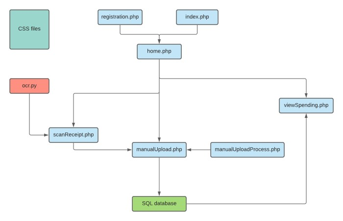
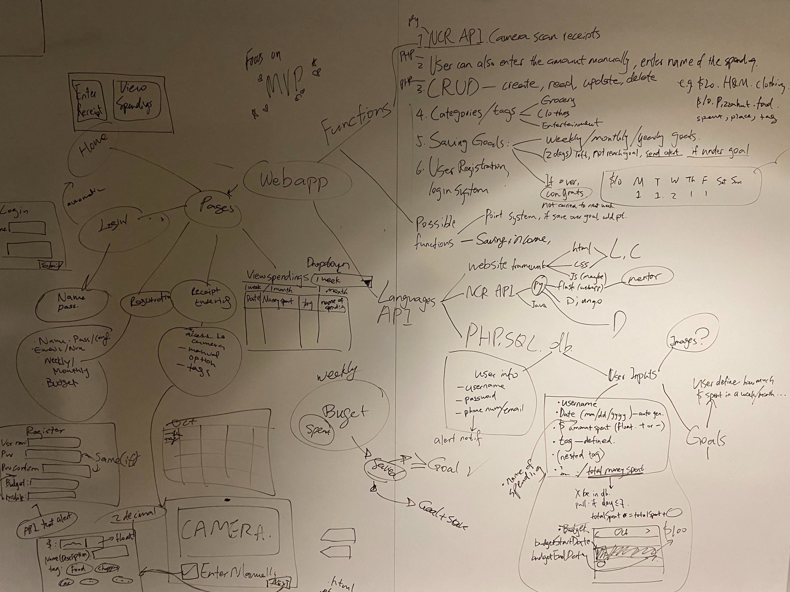
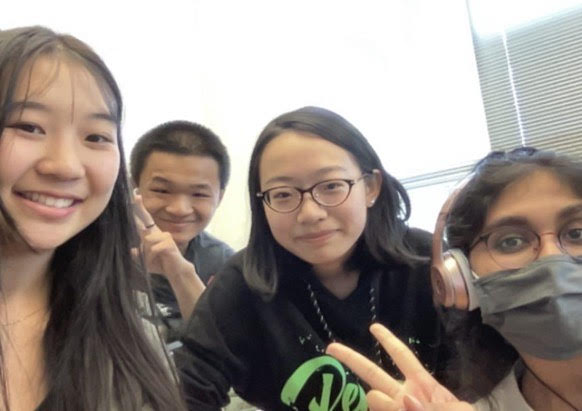

<!-- ABOUT THE PROJECT -->
## Broke Besties

"Would you like a receipt?" "Yes, please." we say automatically to the cashier, just to throw it away into the trash a few steps away. Many nights later, we will awake in a cold sweat, realizing we needed to keep that one to get it reimbursed, or to do the bank statements at the end of the month.

Broke Besties is a personal finance webapp which provide the tools that help you budget and set personal goals. 

Broke Besties features:
* Account registeration and authentication
* Goal setup for the user while using graphs and calendars to help them keep track of their financial history.
* Optical character recognition (OCR) for receipt data, storing merchant information, time and location or purchase, and total cost. Javascript image capture and OCR communication is still to be established.

### To Run

TODO

### Built With

* [Microsoft Azure Form Recognizer](https://azure.microsoft.com/en-us/services/form-recognizer/)

### Technical Details

- OCR utilizes Microsoft Azure Form Recognizer to grab information from a given local image (png, jpg, or pdf) of an commerical receipt, received through the camera scanning function. This information is planned to be parsed from Python to PHP via a JSON format to be processed and stored.
- TODO

<!-- ROADMAP -->
## Roadmap

- [x] Implemented OCR
- [x] Add user registration and login
- [x] Add saving goals
- [x] Add expense tags
- [ ] Full OCR integration with JS
- [ ] Further budgeting and saving features (calendars overlays, goal deviations, etc)
- [ ] Implement a point reinforcement system
- [ ] Launch a full app

<!-- THE TEAM -->
## The Team

- Muchen Zhang (Team Lead)
- Christine Hu
- Lasya Reeni
- Devin Zhang
